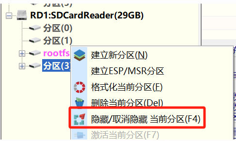

# K230实验班技术资料

## TOC

<!--toc:start-->
- [K230实验班技术资料](#k230实验班技术资料)
  - [TOC](#toc)
  - [技术资料](#技术资料)
  - [Lab0 K230开发环境搭建](#lab0-k230开发环境搭建)
  - [Lab1 SDK基础实验](#lab1-sdk基础实验)
  - [Lab2 视频编解码实验](#lab2-视频编解码实验)
  - [Lab3 GUI实战](#lab3-gui实战)
  - [Lab4 KPU加速模型推理](#lab4-kpu加速模型推理)
      - [Lab4.1 图片分类实验](#lab41-图片分类实验)
      - [Lab4.2 目标检测实验](#lab42-目标检测实验)
      - [Lab4.3 人脸检测实验](#lab43-人脸检测实验)
  - [K230端到端探索](#k230端到端探索)
<!--toc:end-->

## 技术资料

- 课程主页：https://riscv-edu.cn/course/230
- 实验指导手册：https://riscvedu.com/K230/intro.html

- [K230文档及相关资源Github主页](https://github.com/kendryte/k230_docs)
    - [K230 SDK CanMV Board Demo使用指南](https://github.com/kendryte/k230_docs/blob/main/zh/01_software/board/examples/K230_SDK_CanMV_Board_Demo%E4%BD%BF%E7%94%A8%E6%8C%87%E5%8D%97.md)

- [RT-Thread社区论坛](https://club.rt-thread.org/index.html)
    - [RT-Smart在riscv中的初始化流程](https://club.rt-thread.org/ask/article/c994a22a0cf2bb76.html)
    - [RT-Smart riscv64汇编注释](https://club.rt-thread.org/ask/article/cb935a6d9794d770.html)

## Lab0 K230开发环境搭建

- [实验指导](https://riscvedu.com/K230/lab0_env_setup.html)
    
    1. 环境搭建与镜像烧写
    2. 通过串口操作开发板

## Lab1 SDK基础实验

- K230 SDK基础实验 hello_world
    - [官方文档](https://github.com/kendryte/k230_docs/blob/main/zh/02_applications/tutorials/K230_%E5%AE%9E%E6%88%98%E5%9F%BA%E7%A1%80%E7%AF%87_hello_world.md)
    - [课程回放](https://riscv-edu.cn/course/230/replay/6366)
    - [实验指导](https://riscvedu.com/K230/lab1_hello_world.html)
    - 编译适用于小核linux/大核rt-smart的可执行程序
        - 在拷贝hello、hello.elf至SD卡时，需要首先对SD卡的分区(3)进行取消隐藏\
        下图为使用DiskGenius取消隐藏的示例：
        

## Lab2 视频编解码实验

- [K230视频编解码API参考文档](https://github.com/kendryte/k230_docs/blob/main/zh/01_software/board/mpp/K230_%E8%A7%86%E9%A2%91%E7%BC%96%E8%A7%A3%E7%A0%81_API%E5%8F%82%E8%80%83.md)
    - [视频讲解](https://riscv-edu.cn/course/230/replay/6374)

> **以下两个实验注意保证开发板和主机处于同一局域网下**
- [K230 编码实战 - rtsp sever搭建和推流文档](./src/lab2_1_rtsp.md)
    - [视频讲解](https://riscv-edu.cn/course/230/replay/6375)
    - [实验指导](https://riscvedu.com/K230/lab2_1_rtsp.html)
    - 实验成功，可以在VLC网络串流中实时看到摄像头拍摄的画面
    

- [venc_mapi API文档](docs/venc_mapi.md)
    - [视频讲解](https://riscv-edu.cn/course/230/replay/6376)
    - [实验指导](https://riscvedu.com/K230/lab2_2_venc.html)
    - 实验成功，可以在视频播放器中播放摄像头拍摄到的视频
    

## Lab3 GUI实战

- [官方文档](https://github.com/kendryte/k230_docs/blob/main/zh/02_applications/tutorials/K230_GUI%E5%AE%9E%E6%88%98_LVGL%E7%A7%BB%E6%A4%8D%E6%95%99%E7%A8%8B.md)
- [视频讲解](https://riscv-edu.cn/course/230/replay/6381)
- [实验指导](https://riscvedu.com/K230/lab3_lvgl.html)

## Lab4 KPU加速模型推理

- [nncase Github主页](https://github.com/kendryte/nncase)
- [课程回放](https://riscv-edu.cn/course/230/replay/6399)
- [实验指导](https://riscvedu.com/K230/lab4_kpu.html)

#### Lab4.1 图片分类实验

- 图片分类demo

    - 实验成功截图

    

#### Lab4.2 目标检测实验

- 目标检测demo

    - 实验成功截图

    

#### Lab4.3 人脸检测实验

- 人脸检测demo

    - 实验成功截图

    

## K230端到端探索

- [课程回放](https://riscv-edu.cn/course/230/replay/6406)
- [AI Cube安装](./src/lab5_end2end.md)
