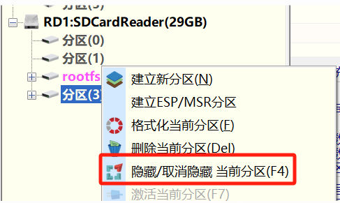

# k230实验班技术资料

- 课程主页：https://riscv-edu.cn/course/230

K230芯片是一款基于RISC-V架构的端侧AIoT芯片，具有高精度、低延迟、高性能、超低功耗、快速启动等特点，可广泛适用于各类智能产品场景，如边缘侧大模型多模态接入终端、3D结构光深度感知模组、交互型机器人、开源硬件、智能制造、智能家居、智能教育硬件等众多领域。

## K230 参数

| 计算单元 | 参数 |
|--------------- | --------------- |
| CPU  | CPU 1: RISC-V处理器，1.6GHz，32KB I-cache, 32KB D-cache, 256KB L2 Cache，128bit; RVV 1.0扩展; CPU 0: RISC-V处理器，0.8GHz，32KB I-cache, 32KB D-cache, 128KB L2 Cache  |
| KPU  | 支持INT8 和INT16 典型网络性能：Resnet 50 ≥ 85fps @INT8 ；Mobilenet_v2 ≥ 670fps @INT8；YoloV5S ≥ 38fps @INT8 |
| DPU  | H.264和H.265编码器和解码器最大分辨率支持4096\*4096 编码器性能：3840\*2160@20fps 解码器性能：3840\*2160@40fps JPEG编解码器：支持最大8K（8192\*8192）分辨率 |
| 图像输入 | 支持最大3路 MIPI CSI(1x4lane+1x2lane) 或 3x2lane   |
| 显示输出 | 1路MIPI DSI, 1x4 lane 或 1x2 lane 最大分辨率1920*1080@60fps  |
| 片上接口 | 5xUART 5xI2C 6xPWM 64xGPIO + 8xPMU GPIO 2xUSB 2.0OTG 2xSDxC: SD3.01, eMMC5.0 3xSPI: 1xOSPI + 2xQSPI WDT / RTC / Timer|

- [k230文档及相关资源Github主页](https://github.com/kendryte/k230_docs)
    - [K230 SDK CanMV Board Demo使用指南](https://github.com/kendryte/k230_docs/blob/main/zh/01_software/board/examples/K230_SDK_CanMV_Board_Demo%E4%BD%BF%E7%94%A8%E6%8C%87%E5%8D%97.md)

- [RT-Thread社区论坛](https://club.rt-thread.org/index.html)
    - [RT-Smart在riscv中的初始化流程](https://club.rt-thread.org/ask/article/c994a22a0cf2bb76.html)
    - [RT-Smart riscv64汇编注释](https://club.rt-thread.org/ask/article/cb935a6d9794d770.html)

## 1.3

- [K230 SDK基础实验 hello_world](https://github.com/kendryte/k230_docs/blob/main/zh/02_applications/tutorials/K230_%E5%AE%9E%E6%88%98%E5%9F%BA%E7%A1%80%E7%AF%87_hello_world.md)
    - 编译适用于小核linux/大核rt-smart的可执行程序
        - 在拷贝hello、hello.elf至SD卡时，需要首先对SD卡的分区(3)进行取消隐藏\
        下图为使用DiskGenius取消隐藏的示例：

        

## 1.4

- [K230视频编解码API参考文档](https://github.com/kendryte/k230_docs/blob/main/zh/01_software/board/mpp/K230_%E8%A7%86%E9%A2%91%E7%BC%96%E8%A7%A3%E7%A0%81_API%E5%8F%82%E8%80%83.md)
    - [视频讲解](https://riscv-edu.cn/course/230/replay/6374)

> **以下两个实验注意连接网线， 保证开发板和主机处于同一局域网下，并修改-s参数为24**
- [K230 编码实战 - rtsp sever搭建和推流文档](https://github.com/kendryte/k230_docs/blob/main/zh/01_software/board/examples/K230_SDK_CanMV_Board_Demo%E4%BD%BF%E7%94%A8%E6%8C%87%E5%8D%97.md#212-rtsp%E6%8E%A8%E6%B5%81demo)
    - [视频讲解](https://riscv-edu.cn/course/230/replay/6375)
    - 实验成功，可以在VLC网络串流中实时看到摄像头拍摄的画面

    

- [venc_mapi API文档](docs/venc_mapi.md)
    - [视频讲解](https://riscv-edu.cn/course/230/replay/6376)
    - [实验指导部分](https://github.com/kendryte/k230_docs/blob/main/zh/01_software/board/examples/K230_SDK_CanMV_Board_Demo%E4%BD%BF%E7%94%A8%E6%8C%87%E5%8D%97.md#22-venc_demo)
    - 实验成功，可以在视频播放器中播放摄像头拍摄到的视频

    

## 1.5
- [K230 GUI实战 - LVGL移植教程](https://github.com/kendryte/k230_docs/blob/main/zh/02_applications/tutorials/K230_GUI%E5%AE%9E%E6%88%98_LVGL%E7%A7%BB%E6%A4%8D%E6%95%99%E7%A8%8B.md)
    - [视频讲解](https://riscv-edu.cn/course/230/replay/6381)
