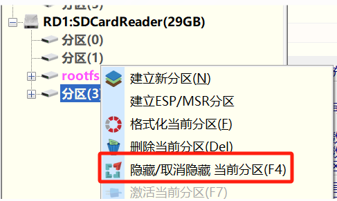

# K230 SDK基础实验 hello_world

- [官方文档](https://github.com/kendryte/k230_docs/blob/main/zh/02_applications/tutorials/K230_%E5%AE%9E%E6%88%98%E5%9F%BA%E7%A1%80%E7%AF%87_hello_world.md)
- [视频讲解](https://riscv-edu.cn/course/230/replay/6366)

## 实验步骤

### 环境准备

k230_sdk中提供了工具链，分别在如下路径。

- 大核rt-smart工具链
```bash
k230_sdk/toolchain/riscv64-linux-musleabi_for_x86_64-pc-linux-gnu
```

- 小核linux工具链
```bash
k230_sdk/toolchain/Xuantie-900-gcc-linux-5.10.4-glibc-x86_64-V2.6.0
```

- 也可通过以下链接下载工具链
```bash
wget https://download.rt-thread.org/rt-smart/riscv64/riscv64-unknown-linux-musl-rv64imafdcv-lp64d-20230222.tar.bz2
wget https://occ-oss-prod.oss-cn-hangzhou.aliyuncs.com/resource//1659325511536/Xuantie-900-gcc-linux-5.10.4-glibc-x86_64-V2.6.0-20220715.tar.gz
```

### 代码编写

- 编写hello.c
```C
#include <stdio.h>
int main (void)
{
    printf("hello world\n");
    return 0;
}
```
- 将hello.c放到与k230_sdk同一级目录下
```bash
canaan@develop:~/work$ ls
hello.c   k230_sdk
```

- 编译适用于小核linux的可执行程序
```bash
k230_sdk/toolchain/Xuantie-900-gcc-linux-5.10.4-glibc-x86_64-V2.6.0/bin/riscv64-unknown-linux-gnu-gcc hello.c -o hello
```

- 编译适用于大核rt-smart的可执行程序
```bash
k230_sdk/toolchain/riscv64-linux-musleabi_for_x86_64-pc-linux-gnu/bin/riscv64-unknown-linux-musl-gcc -o hello.o -c -mcmodel=medany -march=rv64imafdcv -mabi=lp64d hello.c

k230_sdk/toolchain/riscv64-linux-musleabi_for_x86_64-pc-linux-gnu/bin/riscv64-unknown-linux-musl-gcc -o hello.elf -mcmodel=medany -march=rv64imafdcv -mabi=lp64d -T k230_sdk/src/big/mpp/userapps/sample/linker_scripts/riscv64/link.lds  -Lk230_sdk/src/big/rt-smart/userapps/sdk/rt-thread/lib -Wl,--whole-archive -lrtthread -Wl,--no-whole-archive -n --static hello.o -Lk230_sdk/src/big/rt-smart/userapps/sdk/lib/risc-v/rv64 -Lk230_sdk/src/big/rt-smart/userapps/sdk/rt-thread/lib/risc-v/rv64 -Wl,--start-group -lrtthread -Wl,--end-group
```

- 拷贝hello、hello.elf至SD卡
    - 需要首先对SD卡的分区(3)进行取消隐藏\
    下图为使用DiskGenius取消隐藏的示例，取消隐藏后，点击左上角保存更改：

    

- 运行程序
    将SD卡插入K230开发板，上电启动
    - 在小核端运行hello
    ```bash
    Welcome to Buildroot
    canaan login: root
    [root@canaan ~ ]#cd /sharefs
    [root@canaan /sharefs ]#./hello
    hello world
    ```
    - 在大核端运行hello.elf
    ```bash
    msh /sharefs>hello.elf
    hello world
    ```
